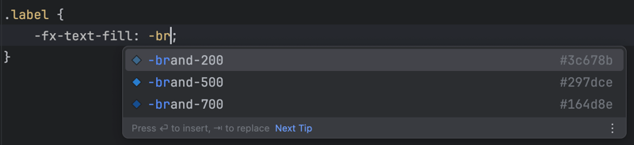
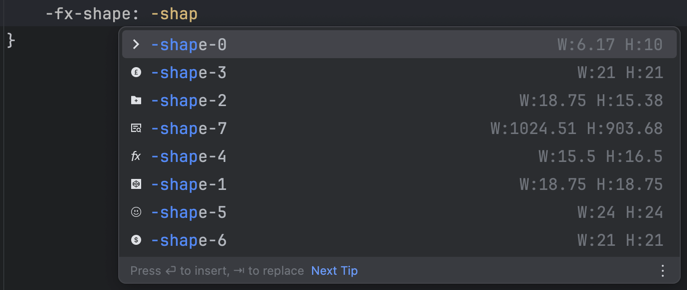
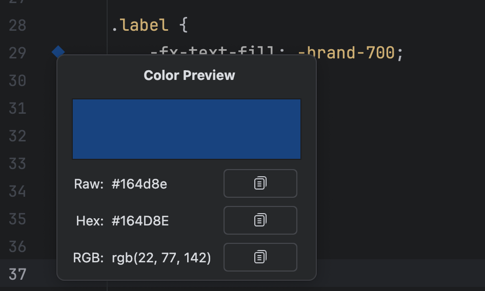
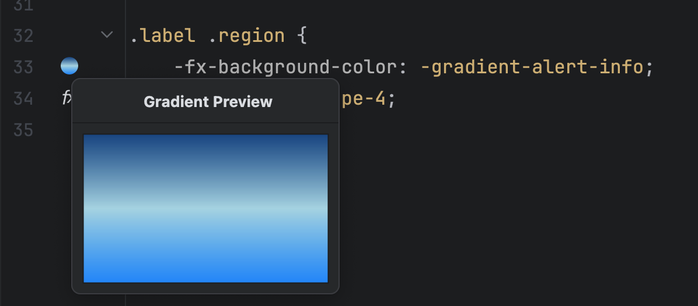
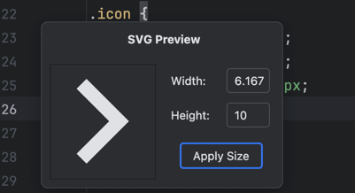

# FXToolkit

**FXToolkit** is a plugin for JetBrains IntelliJ IDEA (Ultimate Edition) designed to enhance the editing experience for
JavaFX CSS files.

It provides intelligent code completion for user-defined color tokens, along with icon previews for colors, gradients,
and SVG shapes directly in the gutter.

---

### Screenshots

<p>
  
  
  
  
  
</p>

## ✨ Features

- 🔍 Autocomplete support for `-fx-*` style properties referencing custom tokens like `-primary-100`,
  `-alert-warning-fill`, etc.
- 🎨 Gutter icon previews:
    - Solid color previews (e.g., `#2196F3`, `rgba(...)`, `-custom-color`)
    - Gradient previews (`linear-gradient(...)`, `radial-gradient(...)`)
    - SVG shape previews (`-fx-shape` with path data)
- 🔤 Optional spellchecking/completion for common JavaFX style property names
- 🔁 Auto-refreshes suggestions when `.css` files are edited

## 🚧 Development Status

This plugin is **currently under development and validation**, and has **not yet been published** to the JetBrains
Plugin Marketplace.

---

## 🧪 Local Testing Instructions

### Run in Development Mode

To test the plugin during development:

1. Open the project in IntelliJ IDEA **Ultimate Edition** (required due to CSS PSI support).
2. Use the Gradle task:

   ```
   Run Plugin
   ```

This will launch a sandbox IDE instance with the plugin installed.

### Build and Test Locally

To build and manually test the plugin:

1. Use the Gradle task:

   ```
   buildPlugin
   ```

2. The plugin zip will be generated at:

   ```
   build/distributions/FXToolkit-<version>.zip
   ```

3. In IntelliJ:

    - Go to `Settings → Plugins → ⚙ → Install Plugin from Disk...`
    - Choose the generated `.zip` file to install the plugin.

---

## ⚠ Requirements

- **IDE Version**: IntelliJ IDEA Ultimate 2024.2 or later
- **Java Version**: JDK 21 (JetBrains Runtime 21 recommended)
- **Gradle Plugin**: JetBrains IntelliJ Gradle Plugin
- **Plugin Dependencies**:
    - `com.intellij.java`
    - `com.intellij.css` (only available in Ultimate Edition)

> 💡 The plugin uses IntelliJ PSI APIs to parse CSS files — hence **Community Edition (IC)** is **not supported**.

---

### Sponsor


Proudly sponsored by [Senapt](https://www.senapt.co.uk/)

